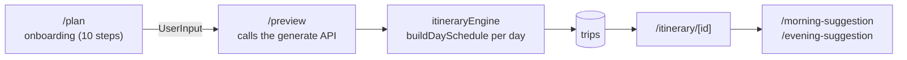

# Barcelona Route: code showcase

This is the itinerary generator for Barcelona. You tell it whare you stay, when you arrive and departure, your inerests, food and cuisine preferences, and it biulds for you day-by-days route with real verified places, schedules your days and a budget estimates. In case if your arriving day hasn't enough time to full itinerary it gives you your personal suggestion, how to spend evening, and the same way if your departure is to early for enjoy full day, it give you morning suggestion. 

**Live product:** https://barcelonaroute.com

[Barcelona Route](public/screenshot.png)

> **Please read this first**
> This repository is a **read-only showcase** of selected files from a private,
> production project. It is **not runnable** on its own. Some imports
> (for example `@/constants/*`, `@/config/*`, `@/lib/supabase/*`, `@/lib/pricing`)
> point to private files that are not published here, on purpose.
> I kept the parts that show how I think and write code, and left out the data,
> secrets, scoring numbers, payment logic and admin tools.

## What it does

1. The user answers a short onboarding flow: dates, group, budget, hotel location,
   interests, food, must-see landmarks and how "touristy" the trip should be.
2. The server builds a **draft** itinerary for each full day.
3. The user sees a free preview, with three first steps, then the full trip.
4. If the user arrives late or leaves early, extra **morning / evening suggestion**
   pages help with the partial days.



## Engineering highlights

### 1. Scheduling algorithm (`algorithms/`)
`buildDaySchedule()` builds one day at a time:
- finds the usable time window (full day, evening only, morning only, or none);
- places the landmarks the user picked first ("golden anchors");
- fills the rest slot by slot (breakfast, attraction, lunch, coffee, dinner),
  filtered by interests, food, budget and opening hours and how 'touristics' have to be places, mean crowded level and popularity;
- adds short "filler" stops along the walking route;
- can attach curated guides and local events.

The result is a draft, not a "perfect" plan. The code is written so that the
user can change it later.

### 2. Time zones done properly
Arrival and departure are stored as UTC (`timestamptz`) but all opening-hours
logic runs in the **city's time zone** (`Europe/Madrid`), no matter where the
visitor's browser is. See `lib/getLocalParts.ts` and `hooks/useTravelDates.ts`.
The morning and evening filters use the same helper, so the "today" check is
correct near midnight and on daylight-saving days.

### 3. Hand-curated data, not "magic" scores
Landmarks have a `place_value` (`golden_anchor`, `iconic`, `waypoint`) that I
curate by hand. I tried scoring everything automatically, but it mixed minor
places with must-see landmarks, so the important layer is manual and the scoring
only ranks inside it. Neighbourhoods use the official district/barri polygons
loaded into PostGIS (`scripts/load-barris.ts`).

### 4. Server-side data handling
- Server Components read the data. The itinerary page sends the client only a
  small public projection of the trip, not the whole database row.
- Lists are paginated, because the API returns a limited number of rows.
- Database errors are reported to Sentry and are **not** shown as "not found".
- Pages are cached with `revalidate`, so new content appears without a redeploy.

### 5. PWA and SEO
Web manifest and service worker, `sitemap.ts`, structured data (JSON-LD),
per-page metadata and canonical URLs.
First time oppened web version of the app, always show concent bunner, and add icon to the phone screen, that allow you use web app like regular native app. 

## Tech stack

| Layer | Choice |
|---|---|
| Framework | Next.js (App Router), React, TypeScript |
| Database | Supabase (Postgres + PostGIS) |
| Payments | Stripe |
| Monitoring | Sentry, PostHog |
| UI | Tailwind CSS, shadcn/ui |
| Maps | Google Maps (itinerary), Mapbox GL (guides) |
| Dates | date-fns, date-fns-tz |

## What is in this repository

```
app/            selected pages: plan, preview, itinerary/[id],
                dashboard, offline, blog, blog/slug,
                morning-suggestion, evening-suggestion, guides/[slug],
                layout, global-error, sitemap, manifest
components/     onboarding steps, itinerary and suggestion views, maps, UI
algorithms/     scheduling logic
hooks/          onboarding state, travel dates
lib/            helpers (time zones, walking route, itinerary engine)
types/          shared TypeScript types
scripts/        generate-icons.mjs, load-barris.ts
```

## What is NOT here (private on purpose)

API routes, admin and auth, payment code, `constants/` and `config/`
(tuning values), `database/` and `services/` (data import pipeline),
the places dataset, and all environment variables.

## Author

Built by **[My Name]**, a self-taught web developer based in Barcelona.
- LinkedIn: https://www.linkedin.com/in/artem-vasyliev-882b02392
- Live site: https://barcelonaroute.com

## License

Copyright (c) 2026 Artem Vasyliev. **All rights reserved.**
The code is published for viewing and review only. You may not copy, modify,
distribute or use it, in whole or in part, without written permission.
